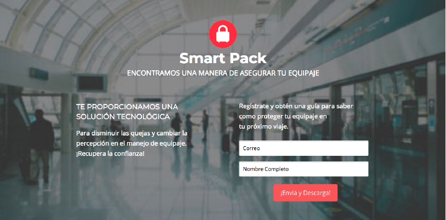

# Laboratoria UX

 **Analis:** Entender y optimizar el journey de tomar
un camión de CDMX Cuernavaca.
_Detectar una oportunidad de negocio_

De la idea al diseño, viviendo todo el journey
Oportunidad detectada "Smart Pack"
Proponemos una interfaz para disminuir las quejas y cambiar positivamente la percepción de la marca específicamente en el manejo de equipaje.

Equipo de trabajo:

1 Dueño de producto Product Owner

1 UX Design

1 UX Research

## Desarrollado para Laboratoria una NUEVA EXPERIENCIA EN EL MANEJO DE TU EQUIPAJE

**Nuestro proceso de diseño**

## DESCUBRIMIENTO E INVESTIGACIÓN
**Planeamiento**

El equipo comenzó la investigación para poder analizar cuáles serían las necesidades de los usuarios, y las metodologías a usar para el reto asignado así como herramientas Analytics.
Posteriormente se realizaron las entrevistas de persona a persona que estaban haciendo fila para comprar  pasajes o esperaban abordar.

Se comenzaron también las encuestas a través de internet, con la finalidad de darnos una idea de la situación actual en el medio web.
Para esta fase del proceso se usaron las siguientes herramientas:
Google form

## SÍNTESIS Y DEFINICIÓN

Luego de analizar todo la información obtenida, nos dimos cuenta de que de las categorías Información y Reclamos tienen mucha coincidencia entre nuestros usuarios.
Dentro de la obtención de nuestra problemática:

El número de usuarios que hace uso del portaequipaje del autobús, es menor al esperado; Sin embargo se rescata que los usuarios en su mayoría:

 Reconocen el mal manejo del equipaje en los viajes

Se agruparon todas las observaciones, comentarios de los usuarios en los siguientes Insights :

**User Persona**

## IDEACIÓN

Prototype
Con nuestro MVP definido, se procede a realizar el prototipo.

**Testing**

Se realizaron diferentes testing con el objetivo de mejorar el proceso; Con herramientas como google Analitics y Hotjar

**User Flow**
MVP

CUSTOMER JOURNEY

